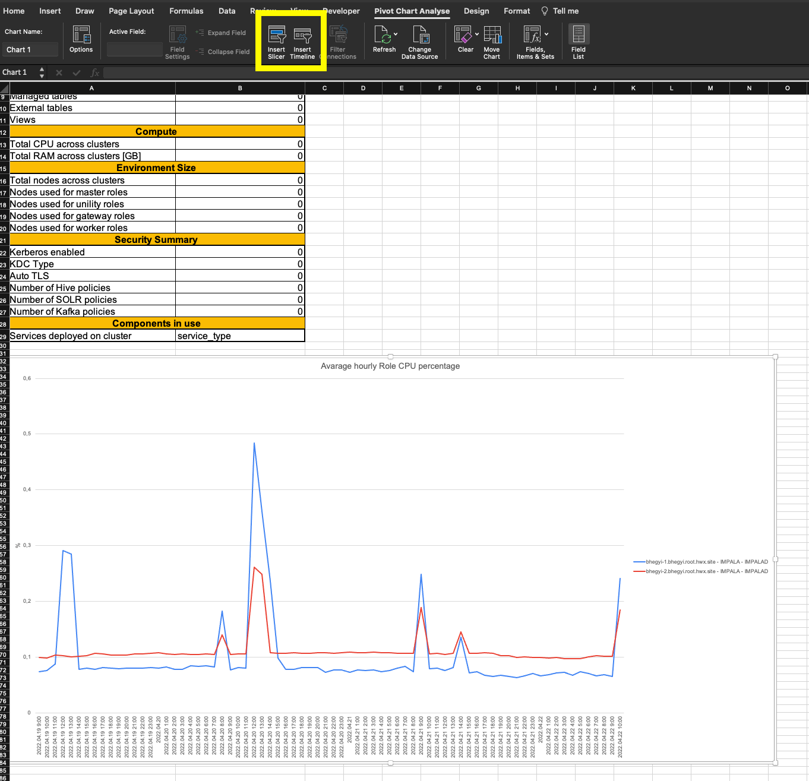
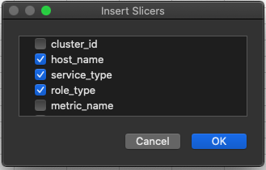
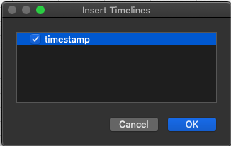
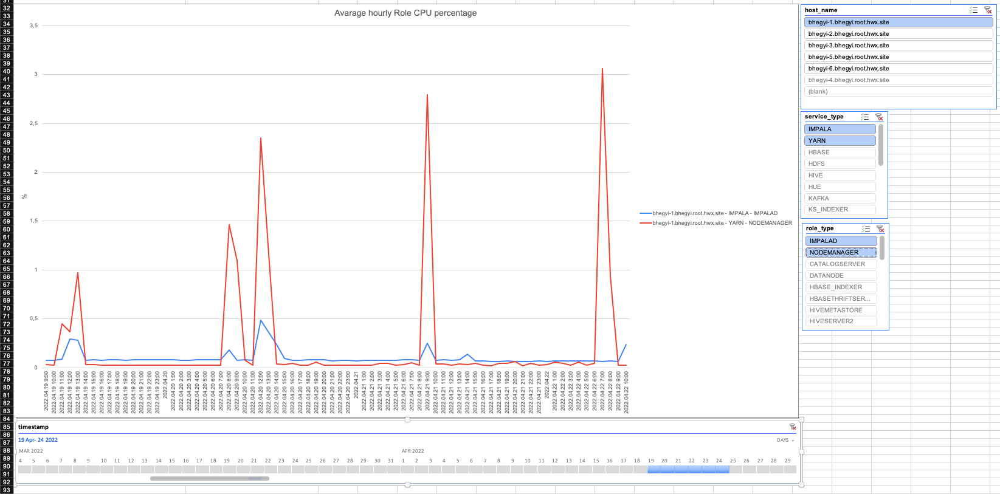

# Discovery reports builder

## Steps

Reports builder is dependent on discovery bundle output. Place the discovery bundle output reachable to the reports builder

Install Python 3.7 and virtual env if not available on cluster node:
```shell
yum install -y gcc openssl-devel bzip2-devel libffi-devel zlib-devel xz-devel && 
cd /usr/src && 
wget https://www.python.org/ftp/python/3.7.11/Python-3.7.11.tgz && 
tar xzf Python-3.7.11.tgz && 
cd Python-3.7.11 && 
./configure --enable-optimizations && 
make altinstall && 
rm -f /usr/src/Python-3.7.11.tgz && 
python3.7 -V &&
cd &&
echo "Python installation successfully finished" &&
python3.7 -m pip install --user virtualenv
```

Copy the project under **/opt** directory:

```shell
cd /opt
# Use git if the environment is not air gaped
yum -y install git
git clone <repo_url>
```

Go to the project directory:
```shell
cd /opt/mac-cdh-discovery-bundle-builder/
```

Create a new virtual environment inside the project directory:
````shell
python3.7 -m venv .venv
source .venv/bin/activate
````

Install the dependencies for the project:
- For environments with internet access:
```shell
pip install -r requirements.txt
```

- For environments without internet access use the prepacked dependencies:
```shell
 tar -zxf wheelhouse.tar.gz
 pip install -r wheelhouse/requirements.txt --no-index --find-links wheelhouse
```

## Run the script
The Discovery reports builder creates an XLSX file based on the discovery bundle directory.

Usage:
```shell
./discovery_reports_builder.sh --discovery-bundle-path=<input_path> --reports-path=<output_path>
```


## Useful report extension with pivot chart elements

Openpyxl is not able to handle pivot table slicers and timelines. To add those follow the instuctions:
- Click on the Pivot chart, add a slicer, and a timeline:



- Select the following filter options for the slicer:



- Add the timestamp as a timeline value:



- Customize the CPU usage chart by Services, Roles or Hosts:

